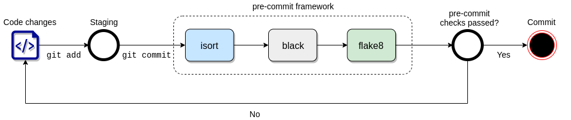

# Machine Learning/Data Science Repository Template

## Components
- poetry as a production-ready dependency manager for python. It has any nice features like defining
the python version, pinning transitive dependencies or creating a file so all developers use the exact same versions.
- python specific .gitignore file
- pre-commit hooks allow you do iterate faster by doing code formatting checks locally 
- ci-cd config for github to automatically execute the tests

    
## Set up 

- (optional): install [pyenv](https://github.com/pyenv/pyenv#installation) to comfortably switch between python versions and install a recent python version
- activate the installed python version with `$ pyenv local *python_version*` or use the already present python version
- make poetry use this version `poetry env use $(pyenv which python)`
- define the python version in pyproject.toml and in .github/workflows/pytest.yaml and the .pre-commit-config.yaml
- update the project name in pyproject.toml
- (optional): point poetry to your pyenv python version `$ poetry env use ~/.pyenv/versions/*python_version*/bin/python`
- install dependencies with `poetry install`. Commit the file poetry.lock that contains the installed dependencies.
- activate the environment with `poetry shell` and run `pre-commit install` to set up the git hook scripts in the .git directory 
  of your project
- run `pre-commit autoupdate` to update the repository references in the 
 .pre-commit-config.yaml file

When all hooks combined in the pipeline the workflow look like this ([image credit](https://rohitgupta.xyz/blog/keeping-python-code-clean-with-pre-commit-hooks-black-flake8-and-isort/))

